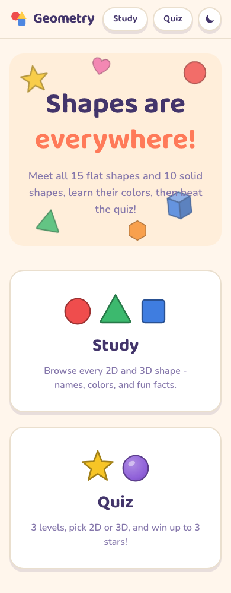
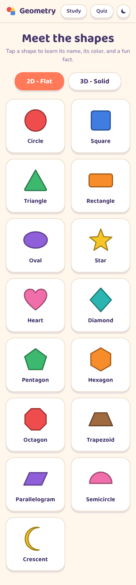

# Geometry

A friendly geometry playground for kids: study every 2D and 3D shape, learn its color, then beat the quiz at 3 levels.

- Local dev: http://localhost:3035
- Production: https://geometry-bheng.vercel.app

## Features

- **Study mode** - browse 15 flat (2D) and 10 solid (3D) shapes. Tap any shape for its name, signature color, sides/corners or faces/edges, a fun fact, a real-world example, and a "Paint it!" row to see the shape in all 9 colors.
- **Quiz mode** - 3 levels (Easy / Medium / Hard), pick 2D, 3D, or Both, and 5 / 10 / 15 questions. Question styles include "Tap the circle", "Tap the blue circle", "How many sides does a hexagon have?", and "Which shape has 8 faces?". Confetti on correct answers, up to 3 stars at the end.
- **Light / dark mode** - follows the system, togglable, persisted.
- Fully responsive, iPad and iPhone friendly, zero external assets.

## Screenshots

| Home | Study | Quiz |
|------|-------|------|
|  |  |  |

## Tech stack

- Next.js 16 (App Router, server components by default)
- React 19, TypeScript (strict)
- Tailwind 4
- node:test for the pure quiz/shape logic (`npm test`)
- Nonce-based CSP via `proxy.ts`, security headers in `next.config.ts`

## Getting started

```bash
npm install
npm run dev        # http://localhost:3035
```

## Scripts

| Script | What it does |
|--------|--------------|
| `npm run dev` | Dev server on port 3035 |
| `npm run build` | Production build |
| `npm run typecheck` | TypeScript, no emit |
| `npm run lint` | ESLint |
| `npm test` | node:test suite for `lib/*` |
| `npm run test:e2e` | Playwright e2e (study, quiz, theme) |

## Project layout

```
app/          routes: / (home), /study, /quiz + robots, sitemap
components/   ShapeSvg, StudyBrowser, QuizGame, ThemeToggle
lib/          pure logic: shapes data, colors, seeded rng, quiz generator
tests/        node:test suites for lib/
e2e/          Playwright specs (study, quiz, theme)
```
