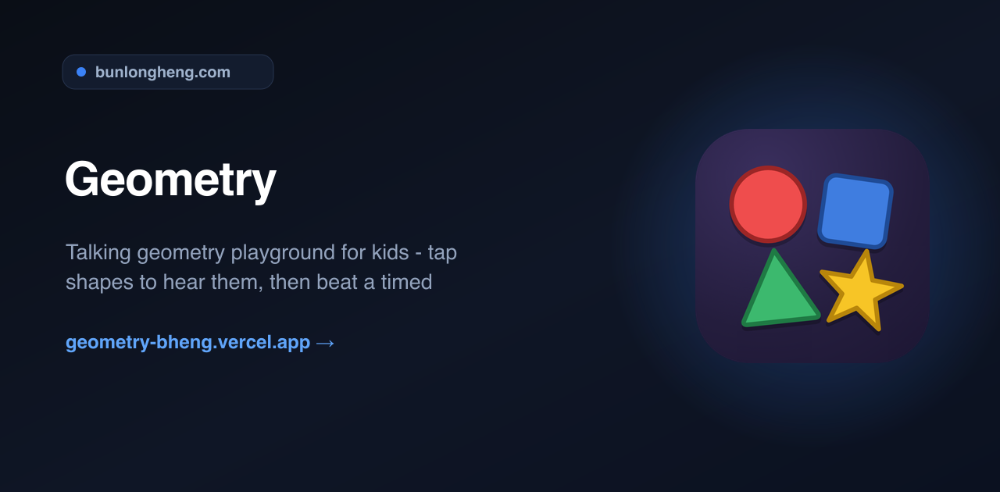
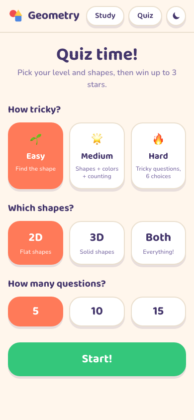
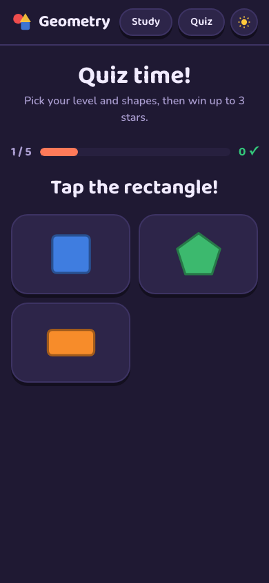
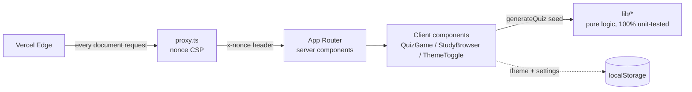

<div align="center">
  
  <h1>Geometry</h1>
  <p><em>Talking geometry playground for kids - tap shapes to hear them, then beat a timed 10-question quiz</em></p>
  <p><a href="https://geometry-bheng.vercel.app">Live</a> &middot; <a href="https://github.com/bunlongheng/geometry">Repo</a> &middot; <a href="https://bunlongheng.com/projects?name=geometry">Portfolio</a></p>
  
</div>

---

# Geometry

A friendly geometry playground for kids: study every 2D and 3D shape, learn its color, then beat the quiz at 3 levels.


[](LICENSE)


**Live:** [geometry-bheng.vercel.app](https://geometry-bheng.vercel.app)

## Contents

- [Features](#features)
- [Screenshots](#screenshots)
- [Architecture](#architecture)
- [Design decisions and trade-offs](#design-decisions-and-trade-offs)
- [Tech stack](#tech-stack)
- [Quick start](#quick-start)
- [Configuration](#configuration)
- [Project layout](#project-layout)
- [License](#license)

## Features

- **Study mode** - browse 16 flat (2D) and 16 solid (3D) shapes, plus 8 line types and 6 angle types. Tap any shape for its name, signature color, sides/corners or faces/edges/corners, a fun fact, and a real-world example.
- **Paint it!** - recolor any shape in 9 colors from its detail card, so kids associate shapes with colors, not just names.
- **Quiz mode** - 3 levels (Easy / Medium / Hard), 2D / 3D / Both scope, 5-15 questions. Question styles: "Tap the circle", "Tap the blue circle", "How many sides does a hexagon have?", "Which shape has 8 faces?".
- **Unambiguous by construction** - the seeded generator guarantees exactly 1 option ever matches the prompt (unit-tested across every level, scope, and seed).
- **Celebration feedback** - confetti on correct answers, a gentle shake plus the right answer on misses, 0-3 stars at the end.
- **Light / dark mode** - follows the system, togglable, persisted, no flash on load.
- Fully responsive, iPad and iPhone friendly, zero external requests at runtime.

## Screenshots

| Study | Quiz setup | Quiz play (dark) |
|-------|------------|------------------|
|  |  |  |

## Architecture

Pure logic lives in `lib/` (shape data, colors, seeded RNG, quiz generator - zero DOM), stateful UI in 3 client components, and thin server-component routes on top. A per-request nonce CSP is stamped in `proxy.ts` and consumed by the layout's pre-paint theme script.



| Layer | Files | Role |
|-------|-------|------|
| `app/` | layout, home, study, quiz, robots, sitemap | server-rendered routes + metadata |
| `components/` | ShapeSvg, StudyBrowser, QuizGame, ThemeToggle | client interactivity |
| `lib/` | shapes, colors, rng, quiz | pure logic, fully unit-tested |
| `proxy.ts` | 1 file | per-request nonce CSP |
| `tests/`, `e2e/` | node:test + Playwright | 25 unit cases, 4 e2e specs |

## Design decisions and trade-offs

| Decision | Chosen | Alternative | Why this trade-off | Cost we accept |
|----------|--------|-------------|--------------------|----------------|
| Quiz generation | Seeded RNG (mulberry32) in pure `lib/quiz.ts` | Random in components | Every quiz is reproducible and the no-ambiguity invariant is provable in tests | A little plumbing to pass seeds |
| Shape rendering | 1 inline SVG renderer for all 62 shapes, lines, and angles | Image assets or a canvas lib | Zero network requests, recolorable at runtime, crisp at any size | A long but flat switch statement |
| Curved-shape counts | Omit sides/faces for hearts, cones, spheres | Teach a convention | The quiz never asks a question with a debatable answer | Fewer counting questions in 3D |
| CSP | Per-request nonce + strict-dynamic via `proxy.ts` | 'unsafe-inline' | Real script hardening even though the app is static | A proxy file and nonce plumbing |
| Fonts | Self-hosted via next/font | Google Fonts CDN | Keeps connect-src 'self', no third-party calls from a kids app | Slightly larger repo build |

## Tech stack

- Next.js 16 (App Router, server components by default), React 19
- TypeScript strict, Tailwind 4
- node:test with `--experimental-strip-types` for unit tests, Playwright for e2e
- GitHub Actions CI (typecheck + lint + unit tests), Vercel hosting

## Quick start

```bash
git clone https://github.com/bunlongheng/geometry.git
cd geometry
npm install
npm run dev
```

Open http://localhost:3035.

| Script | What it does |
|--------|--------------|
| `npm run dev` | Dev server on port 3035 |
| `npm run build` | Production build |
| `npm run typecheck` | TypeScript, no emit |
| `npm run lint` | ESLint |
| `npm test` | node:test suite for `lib/*` |
| `npm run test:e2e` | Playwright e2e (study, quiz, theme) |

## Configuration

No environment variables required - the app reads none at runtime.

## Project layout

```
app/            routes: / (home), /study, /quiz + robots, sitemap
  layout.tsx    fonts, theme pre-paint script, header
  globals.css   design tokens (light/dark) + sticker system
components/     ShapeSvg, StudyBrowser, QuizGame, ThemeToggle
lib/            pure logic: shapes data, colors, seeded rng, quiz generator
tests/          node:test suites for lib/ (25 cases)
e2e/            Playwright specs (study, quiz, theme)
proxy.ts        per-request nonce CSP (Next 16 middleware)
```

## License

[MIT](LICENSE) (c) Bunlong Heng
